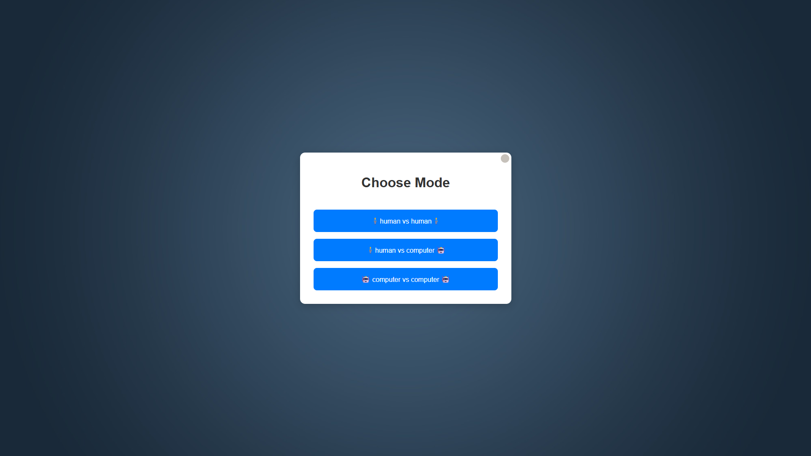
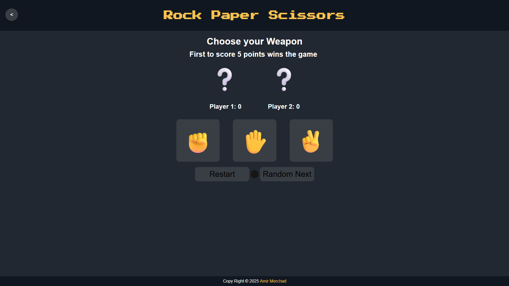
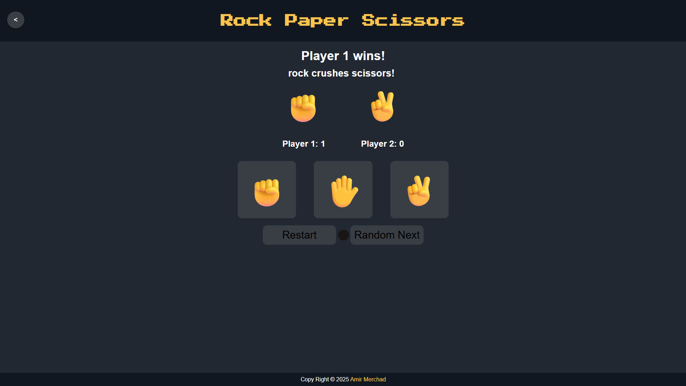

# ✊ Rock Paper Scissors Game

[](https://developer.mozilla.org/en-US/docs/Web/HTML)
[](https://developer.mozilla.org/en-US/docs/Web/CSS)
[](https://developer.mozilla.org/en-US/docs/Web/JavaScript)
[](https://amir-merchad.github.io/Rock-Paper-Scissors/)

A dynamic Rock Paper Scissors game built using HTML, CSS, and JavaScript with multiple game modes and a custom animated cursor. Created as a fun practice project using [WebStorm](https://www.jetbrains.com/webstorm/) IDE.

Built as part of [The Odin Project](https://www.theodinproject.com/) curriculum.

---

## 📸 Screenshots

<p align="left">
  
  
  
</p>

---

## 🎮 Features

- Game Modes:
    - Human vs Human
    - Human vs Computer
    - Computer vs Computer
- Score tracking & winning logic
- Animated custom cursor using CSS + JavaScript
- Smooth UI transitions and error handling
- Fully responsive layout for mobile and desktop
- Local storage support for remembering selected mode

---

## 🚀 Live Demo

[🔗 View Site](https://amir-merchad.github.io/Rock-Paper-Scissors/)

---

## ⚙️ Technologies Used

| Tech              | Version | Notes                                           |
|-------------------|---------|-------------------------------------------------|
| HTML              | 5       | Semantic layout for both pages                  |
| CSS               | 3       | Grid/flexbox layout, transitions, custom cursor |
| JavaScript        | ES6     | Modular structure, functions, DOM control       |
| DOM API           | Web API | Dynamic updates, event listeners                |
| WebStorm          | 2025    | Development environment                         |
| Git / GitHub/ WSL | CLI     | Version control and repo hosting                |
| Chrome            | 125+    | DevTools used for debugging and profiling       |

---

## 📁 Project Structure

~~~plaintext
rock-paper-scissors/
├── index.html
├── game.html
├── script.js
├── style.css
├── images/
│   ├── Background.png
│   ├── img.png
│   ├── img_1.png
│   ├── img_2.png
│   └── questionMark.svg
└── README.md
~~~

---

## 🧠 What I Learned

- How to structure a two-page website with consistent UI/UX
- Clean separation between game logic and UI rendering
- Handling multiple types of game logic (AI vs player, etc.)
- Creating a fully custom mouse cursor and syncing it with DOM interaction
- Using modern CSS (flexbox/grid/variables) to build scalable layouts
- Writing modular, readable JavaScript with reusability in mind
- Managing browser storage and user flow between different HTML pages
- Testing and debugging JavaScript logic with DevTools

---

## 🧪 Run Locally

```bash
git clone https://github.com/yourusername/rock-paper-scissors.git
cd rock-paper-scissors
open index.html
```

---